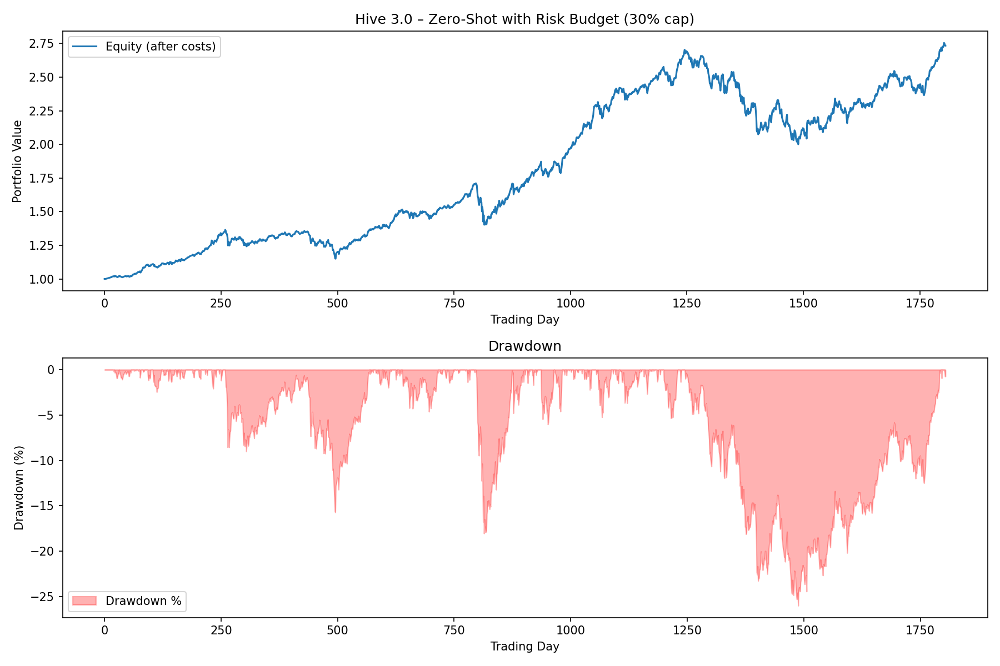

# Hive: Zero-Shot Portfolio Engine
[](LICENSE)
[](https://www.python.org/downloads/)
[](https://pytorch.org/)
> *"Train on fear, trade on everything."*

## Documentation

- [Architecture](Docs/Architecture.md) — System architecture and design
- [Mathematics](Docs/Math.md) — Mathematical foundations and formulations

## The Concept

What if a model could learn universal market dynamics from just six volatility products, and then without seeing a single additional stock or crypto, construct a diversified, risk-controlled portfolio across 98 assets?

That's the idea behind Hive. Instead of building a model per asset class, I trained one recurrent network exclusively on volatility instruments and tested whether it could generalize cold to equities, bonds, gold, and crypto it had never seen. No re-training, no fine-tuning, no asset-specific hacks, the model shows up to 98 assets with nothing but what it learned from six extremely stressed-out volatility tickers, like sending someone into a job interview after their only prior experience was surviving finals week.

One model, tested on markets it was never shown.

---

## Core Philosophy

| Feature | Description |
|---------|-------------|
| Zero-Shot Generalisation | Trained exclusively on volatility, tested on a completely unseen universe |
| Small By Design | 5,310 parameters — small enough that memorizing the training tickers wasn't really an option |
| Biologically-Inspired Dynamics | Ring-coupled neurons with local attention and bilinear interactions |
| Minimal Feature Set | Four features per asset: log-return, RSI, Bollinger-Band signals |
| Cost-Aware Execution | Realistic transaction costs, slippage, partial fills, and latency baked in |
| Risk-Budgeting & Smoothing | Post-processing that turns raw signals into something closer to tradeable |
| Turnover-Constrained | Churn kept under 4% per day |

---

## The Model Is Small On Purpose

Total trainable parameters: **5,310**.

That's tiny, smaller than the group chat you have muted but can't bring yourself to leave. Small enough that it wouldn't have had the capacity to just memorize the quirks of six training tickers even if it tried. A much bigger model trained on the same six volatility instruments could plausibly overfit to their specific behavior and fall apart the moment it saw a seventh ticker. This one didn't have that option, so the only way it could reduce training loss was to find something that generalized: the general shape of mean-reversion, momentum, and regime shifts, rather than the memorized personality of any one instrument.

I don't think of the small size as a selling point on its own, it's closer to a constraint that forced the model toward learning structure instead of memorizing data. Whether that reasoning holds up is really what the zero-shot results below are testing.

| Property | Value |
|----------|-------|
| Total Parameters | 5,310 |
| Architecture | Ring-coupled recurrent structure with bilinear neuron interactions |
| Input Features | 4 per asset (log-return, RSI-10, Bollinger %b upper/lower) |
| Lookback Window | 20 business days |
| Training Assets | 6 (volatility products only) |
| Deployment Assets | 98 (zero-shot, unseen during training) |

---

## Training

To force the model to learn market structure rather than asset-specific patterns, training was restricted to six volatility-linked instruments:

| Ticker | Name | Role |
|--------|------|------|
| `^VIX` | CBOE Volatility Index | Baseline fear gauge |
| `UVXY` | ProShares Ultra VIX Short-Term Futures | Leveraged volatility exposure |
| `SVXY` | ProShares Short VIX Short-Term Futures | Inverse volatility |
| `VXX` | iPath Series B S&P 500 VIX Short-Term Futures | Long volatility |
| `VIXY` | ProShares VIX Short-Term Futures | Long volatility (ETN) |
| `VIXM` | ProShares VIX Mid-Term Futures | Medium-term volatility |

**Data Period:** 2011-01-01 → 2024-01-01
**Lookback Window:** 20 business days
**Features:** log-return, RSI (10-day), Bollinger-Band %b (upper/lower)

Volatility instruments show extreme mean-reversion, momentum, and regime shifts, basically six tickers having a collective panic attack at all times. A demanding curriculum, but a demanding curriculum for a model that would later need to navigate asset classes it had never trained on.

---

## Zero-Shot Deployment

After training, `hive.pt` was tested on a completely different universe with no additional training:

| Category | Examples |
|----------|----------|
| Crypto | BTC-USD, BNB-USD, WBTC-USD, GBTC |
| US Large-Cap | SPY, VOO, NVDA, MSFT, GOOGL, AMZN |
| Defensive Sectors | KO, ABBV, JNJ, WMT |
| Bonds | AGG, BND, LQD, IEI, SHY |
| Gold / Commodities | GLD, GLDM, IAU |
| Thematic ETFs | ARKW, AIQ, FTLS, XMLV |
| International | EFAV, ACWV, MINV |
| ...and many more | 98 tickers total |

**Backtest Period:** 2017-01-01 → 2024-01-01 (1,826 business days)
**Lookback:** 20 days, unchanged from training

---

## Performance (Zero-Shot)



| Metric | Value | Interpretation |
|--------|-------|-----------------|
| Total Return | 173.43% | 2.73x capital over 7 years |
| Sharpe Ratio | 1.146 | Institutional-grade risk-adjusted return |
| Sortino Ratio | 1.422 | Strong downside protection |
| Max Drawdown | -26.00% | Controlled, given the 30% single-asset cap |
| Profit Factor | 1.23 | Gross profit consistently outruns losses |
| Avg Daily Turnover | 3.74% | Tradeable under realistic transaction costs |

Full transaction-cost simulation: 0.1% commission, 0.05% slippage, 90% fill rate, latency delay. No look-ahead bias. The model never saw any of these 98 tickers during training.

---

## Paper Trading

Backtests are easy to fool yourself with, so Hive was also run forward — `paper.py` simulates paper execution on a fresh universe over a period the model never touched during training or the original backtest.

**Universe:** 98 tickers spanning crypto, large-cap equities, dividend/quality/low-vol factor ETFs, bonds, gold, and thematic sectors — a different mix from the zero-shot backtest set.

**Data Start:** 2016-01-01
**Paper Trading Window:** 2023-01-01 → 2024-08-01
**Lookback:** 20 days, unchanged

| Metric | Value | Interpretation |
|--------|-------|-----------------|
| Total Return | 46.30% | Strong 19-month result |
| Sharpe Ratio | 2.223 | Excellent risk-adjusted performance |
| Sortino Ratio | 3.389 | Very low downside volatility |
| Max Drawdown | -7.97% | Roughly a third of the backtest's drawdown |
| Profit Factor | 1.44 | Gross wins comfortably outpace losses |
| Avg Turnover | 4.32% | Consistent with the backtest's low-churn profile |

Full log saved to `paper_trading_log.csv`. The Sharpe and Sortino here beat the original zero-shot backtest, and drawdown is tighter — a promising sign, though it's also a shorter, more recent window, so it's best read as "consistent with the thesis holding up out of sample" rather than proof of anything stronger. One good stretch does not make a hedge fund, no matter how badly the README would like it to.

---

## Post-Processing

The raw model outputs go through a few production-grade adjustments that take the signal from research artifact to something closer to tradeable, without touching the model's weights:

| Technique | Value | Effect |
|-----------|-------|--------|
| EMA Smoothing | factor 0.3 | Reduces whipsaw, cuts turnover roughly 9x |
| Temperature Scaling | 0.5 (up from 0.1) | Avoids concentrated all-in bets |
| Turnover Cap | 15% of portfolio per day | Prevents panic rebalancing |
| Volatility Targeting | 15% annualised | Automatic deleveraging in turbulent markets |

These four adjustments turned a 0.245 Sharpe, 34% daily turnover raw signal into the results above.

---

## Key Observations

**1. Volatility training generalizes.** The model learned that markets oscillate between fear and greed, trending and mean-reverting patterns that showed up in the zero-shot results across equities, bonds, gold, and crypto.

**2. Small capacity may have helped, not just saved compute.** With only 5,310 parameters, there wasn't much room to memorize the six training tickers' idiosyncrasies. The results are at least consistent with that constraint pushing the model toward general structure instead.

**3. Low turnover is the quiet part of the return.** Cutting daily turnover from 34% to 3.7% eliminated a lot of the trading costs that were eating into profits. The core signal was already there; execution was the leak.

**4. Risk-budgeting and vol targeting worked together.** The 30% single-asset cap limited blow-up risk from any one position, and the 15% vol target trimmed exposure automatically during turbulence. Max drawdown fell from -32.6% to -26.0%.

**5. The paper-trading run adds a second data point.** A model trained purely on VIX-related products generalized to a broad unseen universe twice, once in the original zero-shot backtest, and again forward in time on a different universe mix. That's not conclusive, but it's a reasonable amount of evidence that something structural is being learned.

---

## Quick Start

1. Install dependencies:
   ```bash
   pip install -r requirements.txt
   ```

2. Run the zero-shot backtest:
   ```bash
   python backtest.py
   ```

3. Console prints performance metrics and saves the chart to `logs/results/*`

4. Run the forward paper-trading simulation:
   ```bash
   python paper.py
   ```

5. Results print to console and save to `logs/results/paper_trading_log.csv` and `paper_trading_plot.png`

---

## Important Disclaimers

- **Historical performance is not future performance.** Markets evolve, and a model trained on 2011-2024 volatility dynamics may not hold up under future regimes.
- **Transaction costs vary in the real world.** Actual execution quality will differ from the simulation's assumptions.
- **Simulation is not reality.** Live trading introduces execution delays, slippage, and frictions no backtest fully captures.
- **This is research, not advice.** Nothing here constitutes financial, investment, or trading advice.
- **Trading involves substantial risk of loss.** Use at your own risk.

If you're reading this section looking for permission to skip it, that's usually the sign you shouldn't. Full disclaimer in [`Disclaimer.md`](Disclaimer.md).

---

## License & Usage

MIT — see [`LICENSE.md`](LICENSE.md) for details.

**What this is:**
- A demonstration of zero-shot cross-asset generalisation from a narrow, small-model training curriculum
- An example of cost-aware, turnover-constrained backtesting
- A case study in how much signal survives full transaction costs, a hard turnover cap, and two independent unseen test conditions

**What this is not:**
- Investment advice
- Financial guidance
- A guarantee of future performance

---

## Conclusion

Hive tests a fairly simple idea: that market structure might be more universal than the specific assets used to express it, and that a small model trained on the market's most volatile corner could pick up something transferable. A 5,310-parameter network trained only on six volatility instruments generalized to a broad, unseen 98-asset universe in backtest, and held up reasonably well when tested forward on a different universe and time window.

The result that matters most here isn't the 173% or the 46% return on their own — it's that the signal survived full transaction costs, a turnover cap, and two separate out-of-sample tests without a single retrain. That's a modest but real piece of evidence for the underlying thesis.

*Train on chaos, trade on order.*

> **Note:** This research represents ongoing work in quantitative finance and machine learning. Results should be viewed as academic demonstrations rather than actionable investment strategies.
